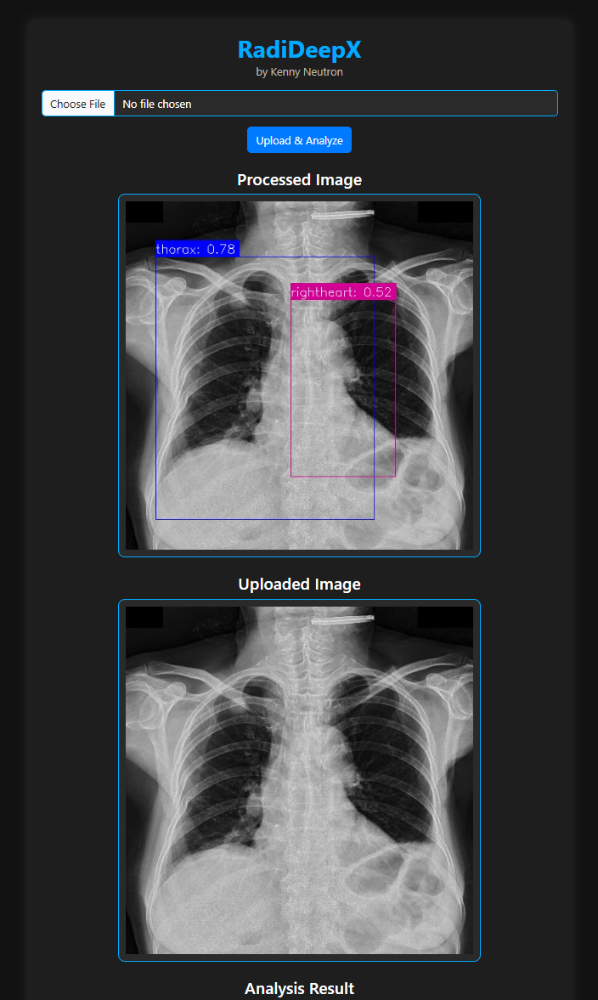

# RadiDeepX - X-ray Analysis

## Description

RadiDeepX is an AI-powered web application for detecting anomalies in X-ray images using deep learning models. It allows users to upload X-ray images, perform AI-based analysis, and visualize the results with bounding boxes.

## Features

- Upload X-ray images for analysis.
- AI-powered detection using deep learning models.
- Processed images with bounding boxes highlighting detected anomalies.
- User-friendly interface with Bootstrap styling.
- Displays both original and processed images.

## Installation

1. Clone this repository:
   ```bash
   git clone https://github.com/KennyNeutron/RadiDeepX.git
   ```
2. Navigate to the project directory:
   ```bash
   cd RadiDeepX
   ```
3. Install dependencies:
   ```bash
   pip install -r requirements.txt
   ```
4. Run the application:
   ```bash
   python main.py
   ```
5. Open your browser and visit:
   ```
   http://127.0.0.1:5000/
   ```

## Usage

1. Click the **Choose File** button to select an X-ray image.
2. Click **Upload & Analyze** to start AI inference.
3. View the **Processed Image** with bounding boxes.
4. The **Uploaded Image** and **Analysis Result** will also be displayed.

## Technologies Used

- **Flask** (Backend Framework)
- **Bootstrap 5** (Frontend Styling)
- **OpenCV** (Image Processing)
- **Roboflow API** (AI Model Inference)
- **HTML, CSS, JavaScript** (Web Development)

## Screenshots



## License

This project is licensed under the MIT License - see the [LICENSE](LICENSE) file for details.

## Author

Developed by Kenny Neutron.
